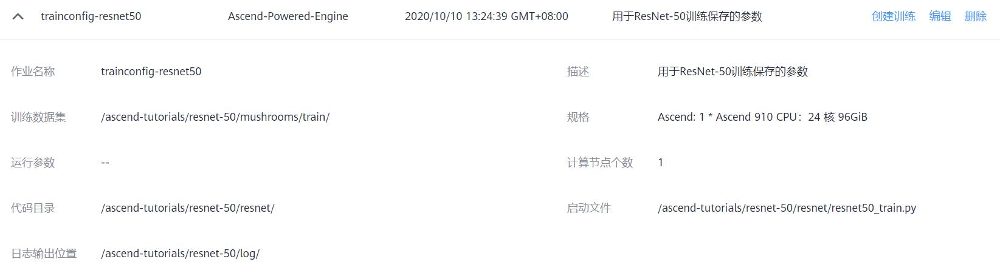
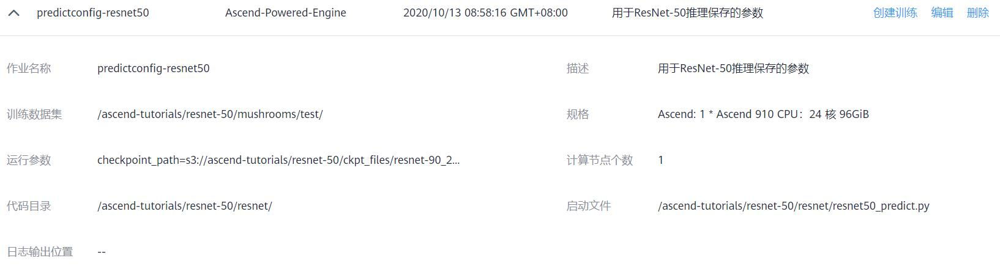

# MindSpore ResNet-50 Tutorial with ModelArts Ascend Service

This is a tutorial for training MindSpore ResNet-50 model to classifying mushrooms.

> **NOTICE:** The codebase of this tutorial is developed based on `v0.5` MindSpore [ModelZoo](https://gitee.com/mindspore/mindspore/tree/r0.5/model_zoo/resnet).

## Guidelines

### Download source code

```
git clone https://github.com/leonwanghui/ms-resnet50-mushroom.git
cd ms-resnet50-mushroom/
```

### Download mushroom dataset

```
cd mushroom-dataset/ && wget https://ascend-tutorials.obs.cn-north-4.myhuaweicloud.com/resnet-50/mushrooms/mushrooms.zip
unzip mushrooms.zip && rm mushrooms.zip
```

### Download the pre-trained ResNet-50 model

```
cd ../resnet_ascend/ckpt_files && wget https://ascend-tutorials.obs.cn-north-4.myhuaweicloud.com/resnet-50/ckpt_files/resnet-50_209.ckpt
```

### Upload the dataset and source code to OBS service

Please upload the mushroom dataset, pre-trained model and source code to [OBS public cloud service](https://www.huaweicloud.com/product/obs.html) with the format requirement below:


### Model training

Firstly, users need to configure the parameters of training workload like below:



Then follow the video below to activate the training workload:

[Watch the video](https://ascend-tutorials.obs.cn-north-4.myhuaweicloud.com/resnet-50/demo/resnet50_train_demo.mp4)

### Model prediction

Firstly, users need to configure the parameters of prediction workload like below:



Then follow the video below to activate the prediction workload:

[Watch the video](https://ascend-tutorials.obs.cn-north-4.myhuaweicloud.com/resnet-50/demo/resnet50_predict_demo.mp4)

## License

[Apache License 2.0](../LICENSE)
